# image segmentation
c++ Implementation of Parameter-free Hierarchical Image Segmentation  
### test1: without post processing
You can see that without post processing, there are many edges.
#### rgb average result

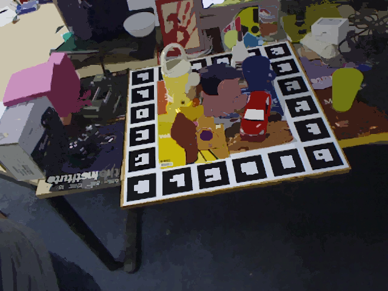
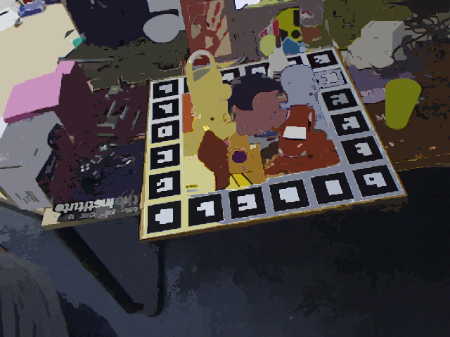
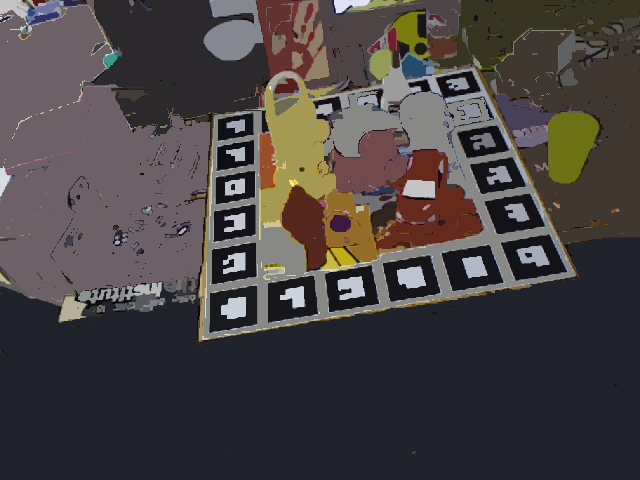
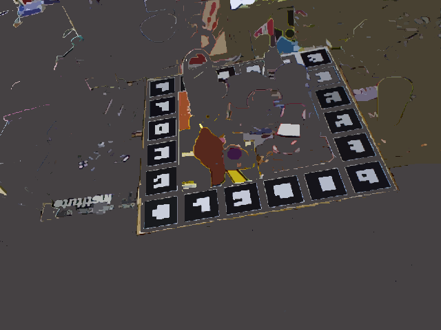
#### lab average result
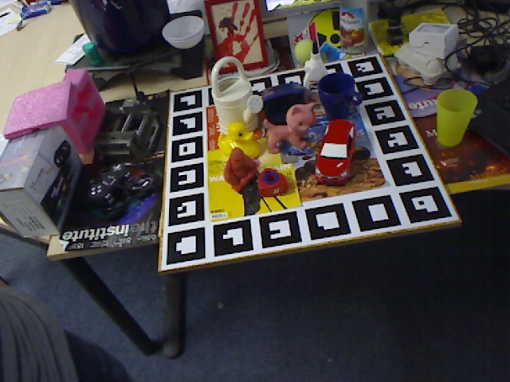

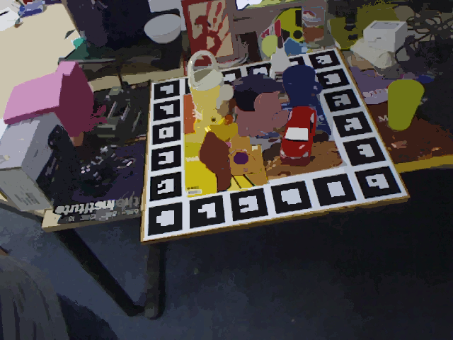
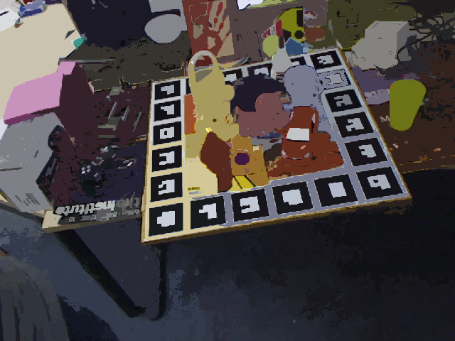
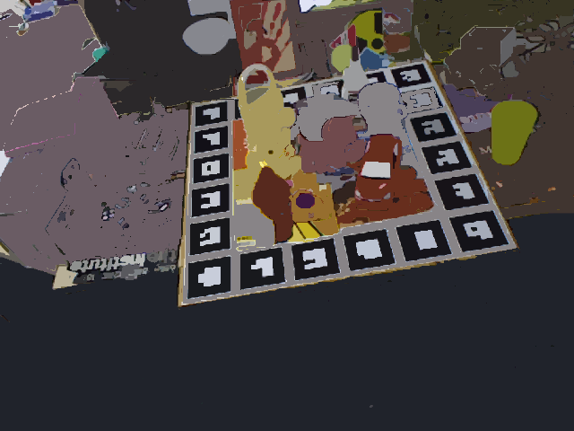
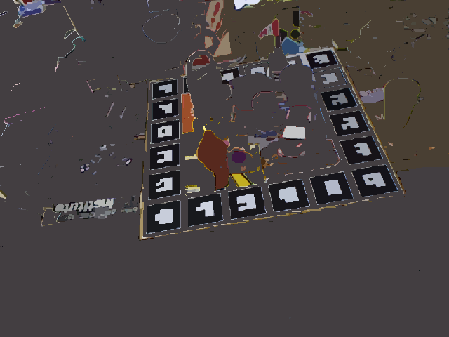
### test2: with post processing
With post processing, look much cleaner
#### rgb average result

#### lab average result
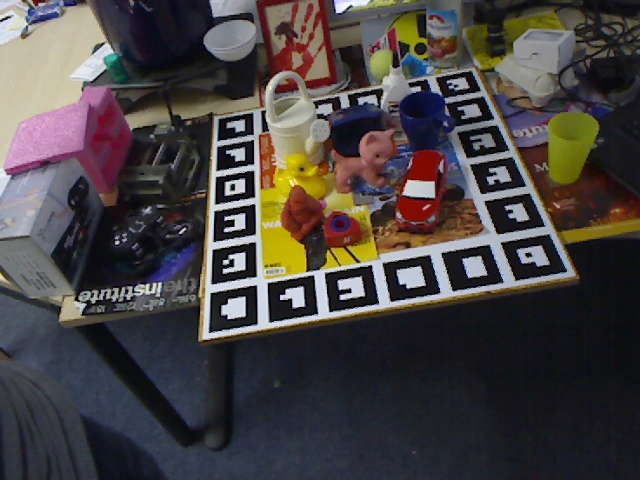

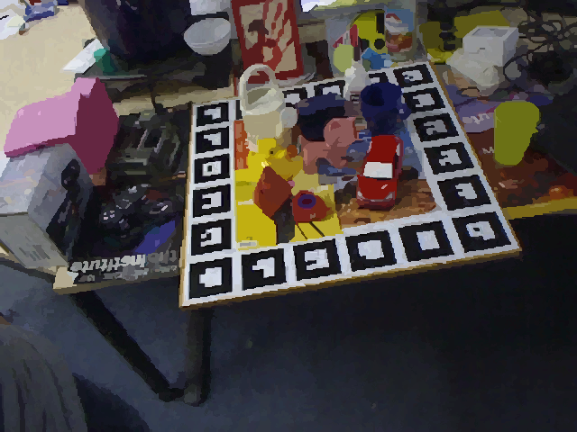

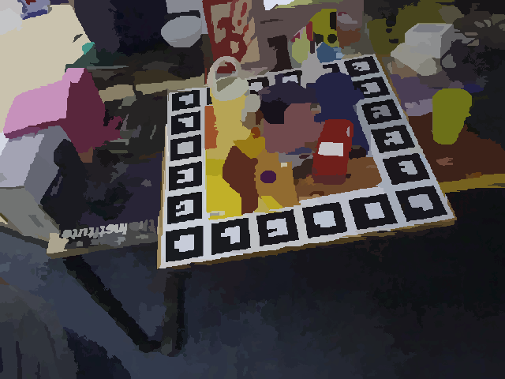
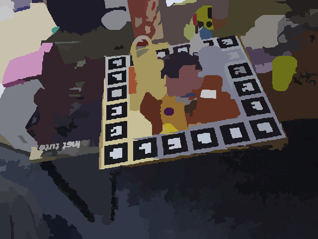
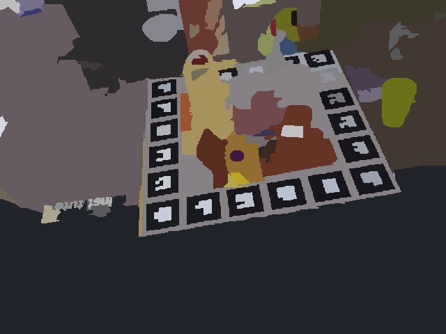
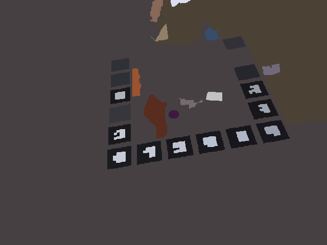