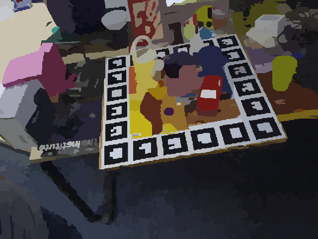
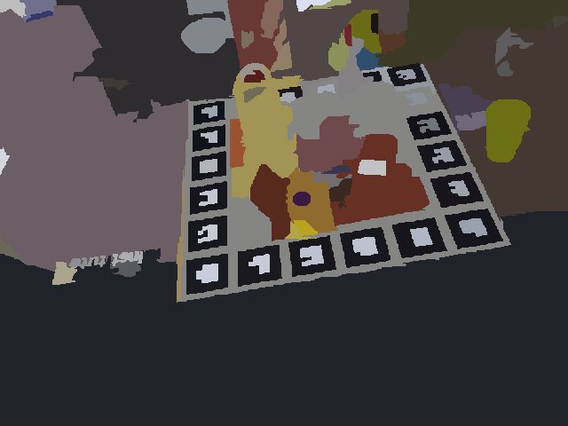
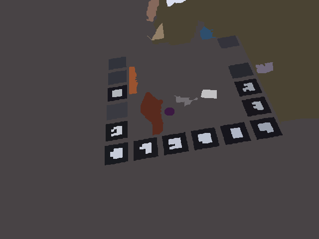

# image segmentation
c++ Implementation of Parameter-free Hierarchical Image Segmentation  
[pdf download](Parameter-free%20Hierarchical%20Image%20Segmentation.pdf)  
Algorithm is graph-based mainly on MST and union find.  
CIEDE2000: lab color space distance measurement, got from github  

#### rgb average result  

